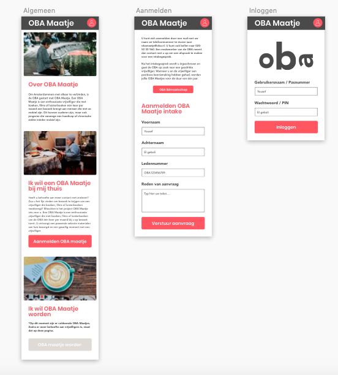
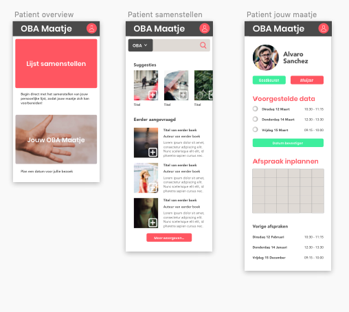
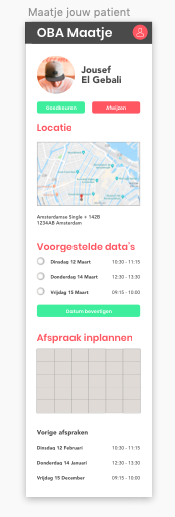

# Project 1 @cmda-minor-web · 2018-2019

## Maak een verbetering op de OBA website met behulp van de API

### concept: OBA Maatje

[Bekijk de applicatie](https://robinstut.github.io/project-1-1819/)


Binnen de OBA is er de mogelijkheid om een OBA maatje aan te vragen wanneer je slecht ter been bent of zodra je fysiek niet in staat bent om de OBA te bezoeken. Wanneer dit het geval is kan je momenteel een mail sturen of telefonisch contact op nemen om door te geven dat je hier interesse in hebt. Je wordt vervolgens gekoppeld aan een Maatje en zodra deze match bevalt, krijg je eens per maand bezoek van jouw Maatje. Het Maatje neemt boeken mee die jij zelf hebt geselecteerd, op een dag die jullie samen hebben afgesproken. Het contact tussen elkaar moet zelf onderhouden worden en het doorgeven of de afspraak netjes verlopen is, moet via de OBA worden aangegeven.

#### Mijn idee

Het afspreken van een datum voor een bezoek dien je nu zelf af te spreken op een methode die voor iedereen anders kan zijn. De boekenlijst moet je ook zelf doorgeven aan jouw maatje, die dit vervolgens weer aan de OBA door moet geven. Ik wil een centraal platform creëren waar de patient zijn interesses kan doorgeven qua bestellingen, een datum kan doorgeven en kan doorgeven of de afspraak zoals gewenst verlopen is. Ook het Maatje heeft de optie om aan te geven dat de afspraak correct verlopen is, en kan ook zijn of haar beschikbaarheden afstemmen met de patient. Tevens heeft het Maatje inzicht in waar de locatie is van de patient, om zo de afspraak te versimpelen.

#### Visuals concept

OBA algemeen ontwerp


OBA patient overzicht, selectie maken en afspraak maken


OBA Maatje afspraak maken



## Installatie proces

```
git clone https://github.com/RobinStut/project-1-1819.git

cd project-1-1819
```
